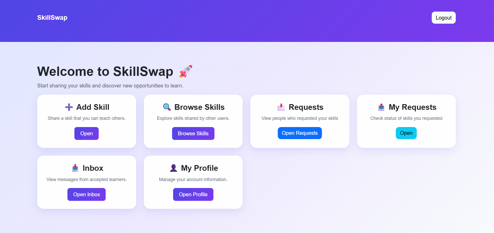

# Skillswap 🔄

Skillswap is a web application where users can list their skills, request to learn new skills, and connect with others for collaboration.

## 🚀 Features:-
- User registration and login system
- Add and browse skills
- Send skill learning requests
- Simple and clean dashboard UI

## 🛠️ Tech Stack:-
- Python (Flask)
- SQLite
- HTML, CSS, JavaScript
- Bootstrap

## 📸 Screenshots:-

### Dashboard Preview
